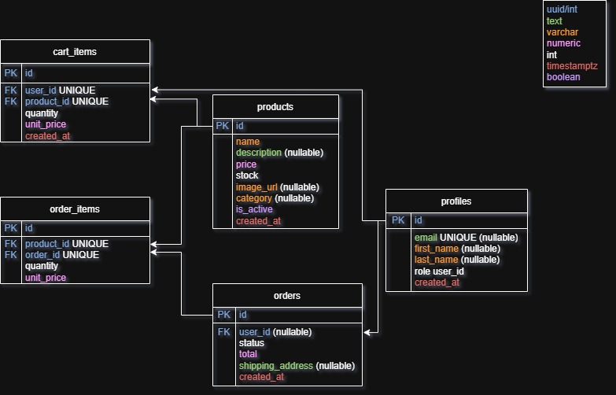
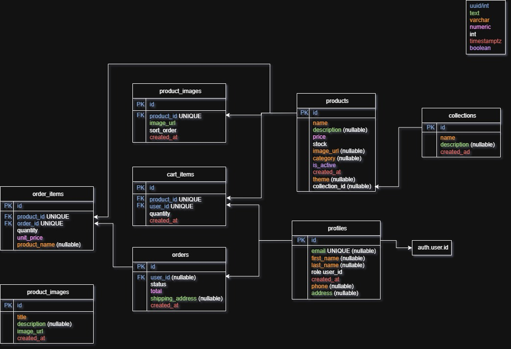

# The Rooted Pages

E-handelsplattform för handtecknade posters, tapeter och tyger.

**Live-sida:** https://the-rooted-pages.vercel.app

---

## Teknisk stack

- **Frontend:** React (Vite), React Router
- **Backend:** Node.js, Express, TypeScript
- **Databas:** Supabase (PostgreSQL), med Row Level Security
- **Autentisering:** Supabase Auth
- **Filhantering:** Supabase Storage (produktbilder)
- **Mejl:** Resend (fakturor och kontaktförfrågningar)
- **Deploy:** Vercel (frontend), Render (backend)

---

## Diagram och planering

### ER-diagram — första version


### ER-diagram — slutversion


> Databasmodellen ändrades en del under projektets gång. Tabellerna `cart_items`, `products`, `orders`, `order_items` och `profiles` fanns med redan i utkastet, men slutversionen fick flera tillägg: `product_images` (flera bilder per produkt), `collections` (relaterade produkter), `gallery_items` (portfoliogalleri), samt `theme` och `collection_id` på `products` och `phone`/`address` på `profiles`. `order_items` fick också ett fryst `product_name`, så att en ändring av en produkts namn i efterhand inte påverkar hur gamla ordrar visas.

### Sitemap
Se [`docs/SITEMAPehandel.pdf`](docs/SITEMAPehandel.pdf) *(PDF renderas inte inbäddat på GitHub, öppnas som separat fil)*

### Tidsplan
Se [`docs/tidsplan.pdf`](docs/TIDSPLANehandel.pdf) *(PDF renderas inte inbäddat på GitHub, öppnas som separat fil)*

---

## Funktioner

- Admin-gränssnitt för att lägga till, redigera och ta bort produkter
- Produkter sparas i databasen (namn, beskrivning, pris, lager, bild, kategori)
- Kunder kan se produktlista och lägga produkter i varukorgen
- Kunder kan lägga en beställning (formulär: namn, e-post, adress — ingen kortbetalning)
- Ordern sparas i databasen med tillhörande orderrader
- Admin kan se en lista över alla ordrar: kund, orderrader, totalbelopp
- Sidan är deployad och nåbar publikt
- Varukorgen sparas i databasen (`cart_items`), inte i React-state
- Inloggning krävs för att redigera produkter (adminskydd via Supabase Auth + rollkontroll)
- Admin kan markera orderstatus: **Beställd**, **Behandlas**, **Levererad**, **Återbetald**
- Sökfunktion, filtrering (typ/tema) och sortering på produktsidan
- Flera bilder per produkt med lightbox-visning
- Kollektioner — relaterade produkter länkas till varandra
- Kundkonto ("Mina sidor") med sparad profil och orderhistorik
- Bildgalleri för portfolio-exempel (logotyper) med kontaktformulär
- Mobilanpassad design

---

## Testguide

### Testa som kund (ingen inloggning krävs för att bläddra)

1. Gå till [the-rooted-pages.vercel.app](https://the-rooted-pages.vercel.app)
2. Bläddra bland produkter på `/products`, testa filter/sök/sortering
3. Klicka på en produkt för detaljvy
4. Klicka **Logga in** → **Skapa konto** (`/register`) för att registrera ett nytt testkonto, eller använd:

   ```
   E-post:    customer@trp.com
   Lösenord:  CustomerLogin1
   ```

5. Lägg en produkt i varukorgen, gå till `/cart`
6. Fyll i leveransadress, klicka **Betala** → bekräfta köpet
7. En faktura skickas via mejl till kontots e-postadress *(observera: p.g.a. begränsningar i Resends kostnadsfria testläge kan mejl för närvarande bara levereras till projektets egen mejladress — se avsnittet [Kända begränsningar](#kända-begränsningar))*

### Testa som administratör

```
E-post:    admin@trp.com 
Lösenord:  AdminLogin1
```

1. Logga in på ovanstående konto
2. En **Admin**-länk syns nu i navigeringen
3. Under **Admin → Produkter**: lägg till, redigera eller ta bort en produkt
4. Under **Admin → Ordrar**: se alla lagda ordrar och ändra status på en av dem via dropdown-menyn
5. Prova att logga ut och besöka `/admin/products` direkt via URL som utloggad — sidan ska neka åtkomst och skicka vidare till inloggning

---

## Kända begränsningar

- **Fakturamejl:** skickas via Resend i kostnadsfritt testläge utan verifierad avsändardomän, vilket begränsar leverans till projektets egen mejladress. En verifierad domän hade löst detta i en produktionssättning. En alternativ lösning via Gmail/SMTP testades men fungerar inte på Renders kostnadsfria hostingnivå, som blockerar utgående SMTP-trafik (portarna 25, 465, 587) sedan hösten 2025.
- **Betalning:** checkout är ett formulär utan faktisk kortbetalning eller tredjepartsintegration, i enlighet med uppgiftens omfattning.
- **Render (gratisnivå):** backend-tjänsten kan behöva ~30–50 sekunder att "vakna" efter en tids inaktivitet, vilket kan göra första sidladdningen efter ett uppehåll långsammare än normalt.

---

## Lokal utveckling

### Backend
```bash
cd server
npm install
npm run dev
```
Kräver en `.env`-fil med `SUPABASE_URL`, `SUPABASE_ANON_KEY`, `SUPABASE_SERVICE_ROLE_KEY`, `RESEND_API_KEY`, `CONTACT_EMAIL`.

### Frontend
```bash
cd client
npm install
npm run dev
```
Kräver en `.env`-fil med `VITE_SUPABASE_URL`, `VITE_SUPABASE_ANON_KEY`, `VITE_API_URL`.

---

## Projektstruktur

```
/client          React-frontend (Vite)
/server          Express-backend (TypeScript)
/docs            ER-diagram, sitemap, tidsplan
```